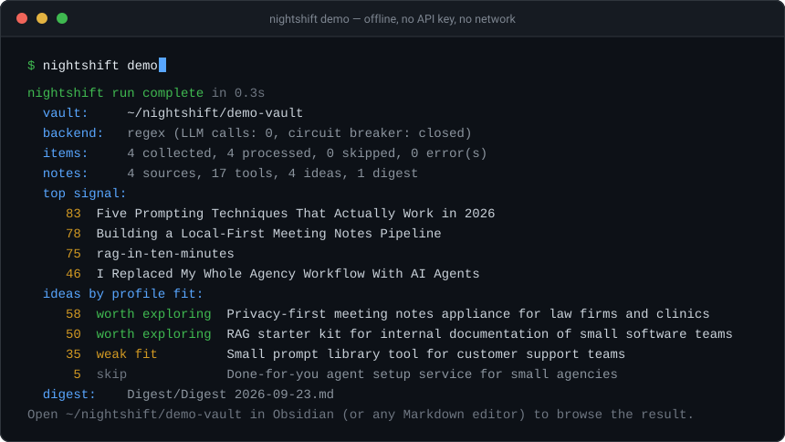
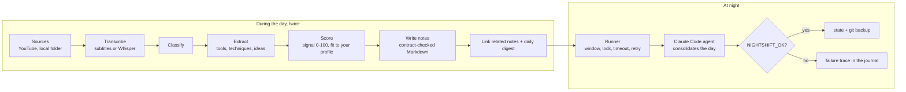

[](https://github.com/martinbouvet2000-tech/nightshift/actions/workflows/ci.yml)
[](LICENSE)
[](pipeline/pyproject.toml)
[](nightly/README.md)
[](vault)
[](#try-it-in-one-minute-no-api-key-no-network)

**A second brain that works while you sleep.**

You save videos, talks and notes all day and remember almost none of it. nightshift turns them into structured, scored Markdown notes, then runs an AI agent overnight that consolidates what you learned into your vault. Your notes compound on their own, and your AI agents can search them before they answer you.

```
capture ─► transcribe ─► extract + score ─► write notes ─► night shift ─► backup
 YouTube    Whisper /     LLM (or offline   Obsidian-      Claude Code    git
 local dir  subtitles     heuristics)       ready vault    at 00:30
```

It's the open-source core of the system I run every day ([case study](https://martinbouvet2000-tech.github.io/work/ai-os.html)). The personal parts are gone. Everything here runs on your machine, and your notes stay plain Markdown.

## Why

Read-it-later apps and AI chat windows both forget. A saved video is a bookmark you never open again; a chat answer disappears when the tab closes. nightshift makes the opposite bet: put everything in plain Markdown files you own, enforce a data contract so the files stay machine-readable, and let an agent work on them while you're asleep. What you get in the morning isn't a feed — it's notes that link to each other, scored against *your* profile, that your other agents can read before they answer you. No lock-in: it's a folder of `.md` files, and you can delete this repo and keep them.

## Try it in one minute (no API key, no network)

```bash
git clone https://github.com/martinbouvet2000-tech/nightshift
cd nightshift/pipeline
python -m venv .venv && . .venv/bin/activate    # Windows: .venv\Scripts\activate
pip install -e .
nightshift demo
```

The demo runs the full pipeline on four bundled sample transcripts with the offline extractor and writes a small vault to `./demo-vault`:



Open `demo-vault` in Obsidian, or check it against the data contract:

```bash
node ../vault/audit.mjs --vault demo-vault --strict
```

## How it works



## Repo map

| Path | What it is | Runtime | Tests |
|---|---|---|---|
| [`pipeline/`](pipeline) | Python package and CLI (`run`, `demo`, `health`). Pluggable sources, extraction and scoring stages, contract-safe note writer, offline demo. | Python 3.10+, PyYAML | 70 |
| [`vault/`](vault) | Node tools: a contract-aware writer, an auditor, a link fixer and a normaliser (dry-run by default), and a git backup. | Node 18+, zero deps | 9 |
| [`nightly/`](nightly) | The night shift: a cross-platform runner around `claude -p` and the consolidation prompt, plus scheduler examples for Task Scheduler, cron and launchd. | Node 18+, zero deps | 10 |
| [`vault/CONTRACT.md`](vault/CONTRACT.md) | The data contract every note obeys — enforced by the writer, checked by the auditor. | — | — |
| [`.github/workflows/ci.yml`](.github/workflows/ci.yml) | Both suites plus the offline demo, on Ubuntu and Windows. | — | — |

```bash
cd pipeline && pytest -q                                      # 70 tests
node --test vault/test/*.test.mjs nightly/test/*.test.mjs     # 19 tests
```

## Design decisions

- **Free first, paid as plan B.** Extraction tries the `claude` CLI you already pay for, then the Anthropic API if `ANTHROPIC_API_KEY` is set, then a deterministic offline extractor. After 5 LLM failures in a row a circuit breaker stops calling the model for the rest of the run.
- **A data contract, enforced by code.** Every note has YAML `tags` as a list, `created` and `updated`, an H1 equal to its filename, and no links to notes that don't exist. The pipeline writes to it, the auditor checks it, and the night agent is told to respect it. See [`vault/CONTRACT.md`](vault/CONTRACT.md).
- **Failure is designed in.** Writes are atomic, filenames are sanitised against path traversal and reserved names, and one bad item never aborts a run.
- **The night agent proves it ran.** It must end with `NIGHTSHIFT_OK <journal> notes=N links=N proposals=N`. If that line is missing, the runner writes a failure line into your journal, so in the morning "nothing to do" is never confused with "didn't run".
- **Least privilege at night.** The agent runs in `acceptEdits` mode with no extra tool grants and no shell. It makes safe additive changes itself and only *proposes* risky ones.
- **Scored against you, not against the internet.** Ideas are ranked with a `profile.yaml` you write: your interests, skills and constraints.

## Set it up for real

1. **Configure the pipeline.** Copy `pipeline/config.example.yaml` to `config.yaml` and `profile.example.yaml` to `profile.yaml`, then set your vault path (or the `NIGHTSHIFT_VAULT` env var) and your YouTube channels. Optional extras: `pip install -e ".[youtube]"` for yt-dlp and `pip install -e ".[whisper]"` for local transcription.
2. **Run it:** `nightshift run`, or `nightshift run --sources local --limit 5` to start small. `nightshift health` checks your setup.
3. **Add the night shift.** You need [Claude Code](https://claude.com/claude-code). Try `node nightly/runner.mjs --dry-run --vault <your vault>`, then schedule it with one of the examples in [`nightly/schedule/`](nightly/schedule).
4. **Back up.** If your vault is a git repo, `node vault/backup.mjs --vault <your vault>` commits and pushes it. Schedule it too.

## Threat model

Transcripts come from the internet, so treat them as untrusted input: a video could contain text written to steer an AI agent.

- The night agent is granted no extra tools: reads, and writes in `acceptEdits` mode, stay inside the vault (Claude Code's working-directory limit), and it has no shell. It can't read your SSH keys and paste them into a note that `backup.mjs` would push.
- Notes are written through sanitised filenames and a path join that refuses to leave the vault.
- The API key is read from the environment only, and it's never sent to a non-`https://` base URL.
- Review what the agent changed (`git diff` in your vault) before you rely on it, at least for the first nights.

The full policy, including what is in and out of scope and how to report a problem privately, is in [SECURITY.md](SECURITY.md).

## Status and limits

This is v0.1, extracted from a personal system that has been running daily, not a polished product.

- The offline extractor is heuristic; LLM mode is much sharper.
- YouTube and Whisper are covered by mocked tests only in CI.
- Idea scoring against your profile is keyword-based.
- The night runner is tested with a mocked `claude` call; the real prompt has only run in the original personal setup.
- Social-network connectors aren't included: they rely on unofficial APIs.

Issues and pull requests are welcome, especially new `Source` implementations (podcasts, RSS, read-later exports).

## Roadmap

Ideas, not promises, and not in any order. Nothing here is scheduled, and I'd rather merge a good PR than build all of it myself. Each item maps to a limitation above.

- **More sources.** Podcasts (RSS with a transcript tag, audio through Whisper otherwise), plain RSS/Atom, and read-later exports (Pocket, Instapaper, Readwise). The `Source` interface exists for exactly this — see [Adding a new Source](CONTRIBUTING.md#adding-a-new-source). Official APIs and open formats only.
- **Semantic idea scoring.** Profile fit is keyword matching today. Local embeddings would rank ideas by meaning instead of by vocabulary, without sending anything anywhere.
- **Real-run coverage for the night runner.** The runner is well tested against a mocked `claude`; the prompt itself has only ever run in my setup. A reproducible end-to-end harness on a throwaway vault would turn that caveat into a test.
- **Packaging to PyPI.** `pip install nightshift` instead of a clone and an editable install. Blocked on nothing but a naming check and a release workflow.

If one of these matters to you, say so in an issue — that is the only prioritisation signal there is.

## Contributing

[CONTRIBUTING.md](CONTRIBUTING.md) has the dev setup for both halves, how to run the suites, and a walkthrough for adding a `Source`. By participating you agree to the [Code of Conduct](CODE_OF_CONDUCT.md). Release notes live in [CHANGELOG.md](CHANGELOG.md).

## License

[MIT](LICENSE) © 2026 Martin Bouvet
